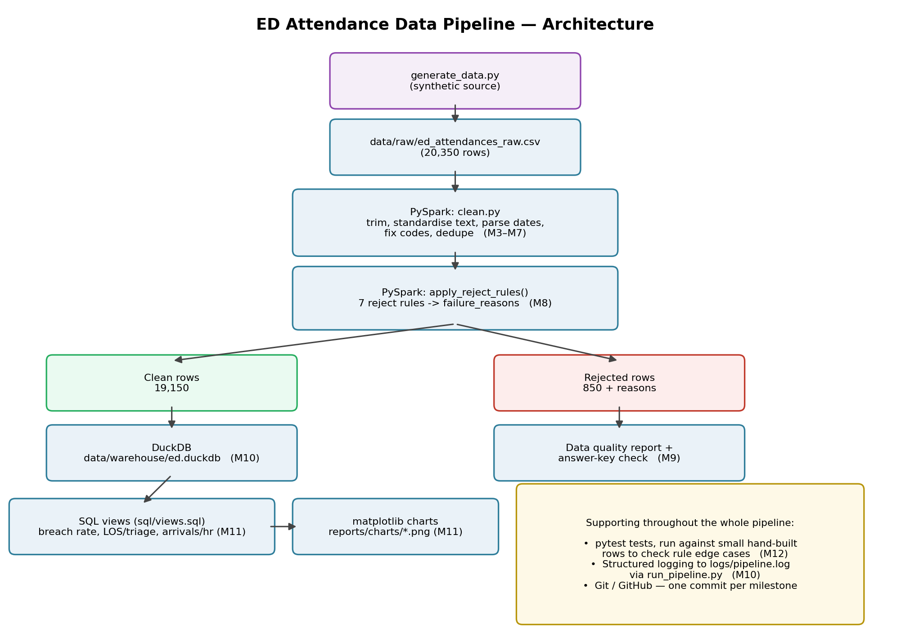

# ED Attendance Data Pipeline

A synthetic-data pipeline that ingests messy Emergency Department (ED)
attendance records, cleans and validates them with PySpark, quarantines
bad records with reasons, loads clean data into DuckDB, and produces
SQL-based KPI views and charts.

Built as a personal project to demonstrate PySpark, SQL, data quality
validation, testing and documentation practices.

**All data is synthetic. No real patient information is used anywhere.**



## What it does

1. Generates a synthetic ED attendance dataset (20,350 rows) with
   deliberately realistic data quality problems
2. Cleans it with PySpark: standardises text, parses 4 mixed date
   formats, fixes codes, removes duplicates
3. Validates every row against 7 business rules, splitting the data
   into clean (19,150 rows) and rejected (850 rows, each tagged with
   why it failed)
4. Produces a data quality report, and checks it against the known set
   of planted errors (0 false positives, 0 false negatives)
5. Loads the clean data into a DuckDB database
6. Answers three business questions with SQL views, and charts two of
   them

## How to run it

```bash
python3 -m venv .venv
source .venv/bin/activate      # Windows: .venv\Scripts\activate
pip install -r requirements.txt

python3 src/generate_data.py    # creates the synthetic raw data
python3 src/run_pipeline.py     # runs the full pipeline end to end
python3 src/make_charts.py      # builds the SQL views and charts
pytest                          # runs the test suite
```

Requires Python 3.11+ and Java 17+ (PySpark runs on the JVM).

## Key results

| Measure | Value |
|---|---|
| Raw rows | 20,350 |
| Duplicates removed | 350 |
| Rows rejected | 850 |
| Clean rows | 19,150 |
| 4-hour breach rate | 20.2% |
| Median length of stay | 148 minutes |

## Design decisions

- **Read every column as text (`inferSchema=False`)** and convert types
  explicitly, rather than letting Spark guess — messy source data makes
  automatic inference unreliable, and this keeps every transformation
  visible in code.
- **Reject vs. fix, decided by usability**: a row is only rejected if
  the problem makes it fundamentally untrustworthy (missing/impossible
  timestamps, invalid triage code, missing patient ID). Recoverable
  gaps (missing complaint/disposition, malformed GP code) are fixed or
  flagged in place, not thrown away.
- **Reason-tagged rejects**: every rejected row keeps its original
  values plus an array of every rule it failed, so a real data owner
  could trace the problem back to its source.
- **Validated against ground truth**: because the raw data was
  generated with a known, planted set of errors, I could independently
  confirm my validation rules were exactly correct — 0 false positives
  and 0 false negatives.
- **Spark for the heavy cleaning, pandas/SQL for the small reporting
  step** — a deliberate split based on data size at each stage.

## Assumptions and limitations

- Ambiguous date formats (e.g. day/month vs month/day) were resolved
  by profiling the data's actual distinct formats rather than guessing.
- The 48-hour length-of-stay cutoff and the 4-hour breach threshold are
  fixed thresholds, not configurable — a production version would make
  these configurable per trust/region.
- Runs locally, on demand — no scheduling, orchestration, or cloud
  deployment. In production this would run as a scheduled job with
  monitoring and alerting on the data quality report.
- Synthetic data only. Real ED data would need formal information
  governance approval, and this pipeline's logic would need validation
  against real-world edge cases beyond what was deliberately planted
  here.

## Project structure

```
ed-data-pipeline/
├── data/
│   ├── raw/                    # synthetic input (committed)
│   ├── answer_key/             # planted-error log, for validation only
│   └── warehouse/              # DuckDB file (not committed)
├── src/
│   ├── generate_data.py        # creates the synthetic dataset
│   ├── clean.py                # all cleaning + validation functions
│   ├── load.py                 # loads clean data into DuckDB
│   ├── run_pipeline.py         # runs the whole pipeline, with logging
│   ├── make_charts.py          # SQL views + charts
│   └── profile_dates.py        # exploratory: discover date formats
├── sql/
│   └── views.sql                # 3 KPI views
├── tests/
│   └── test_validation.py       # pytest tests for the reject rules
├── docs/
│   ├── data_dictionary.md
│   └── architecture.png
└── requirements.txt
```